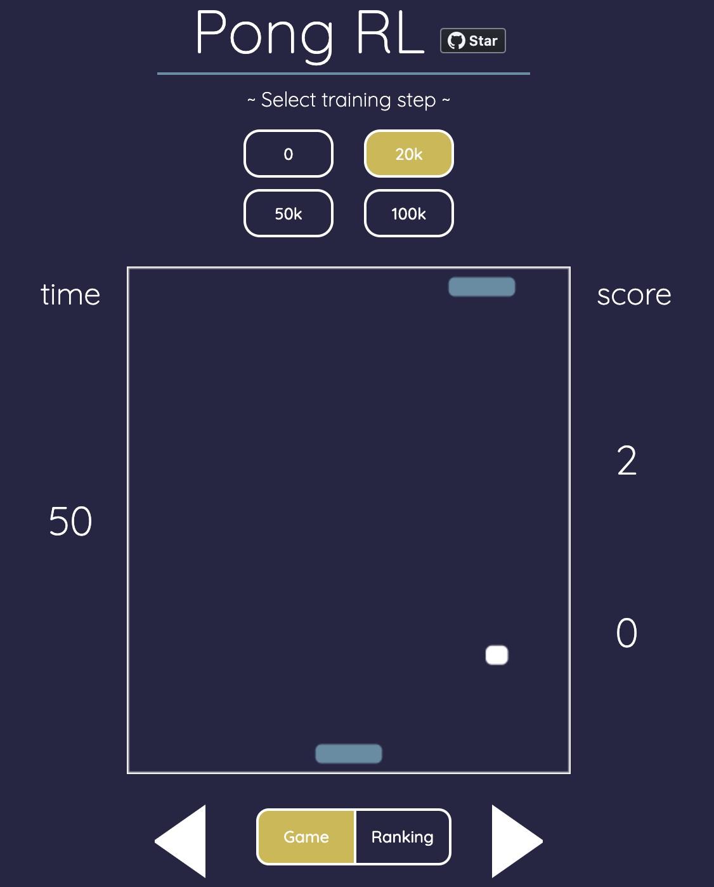

# Pong_RL

## 😄 Introduction

- A pong game where you can battle AI agent trained via reinforcement learning.
- Developed with [@TaiseiHashimoto](https://github.com/TaiseiHashimoto)
- You can select the training steps.
- You can register your score for the rankings.

## 🌱 Link
https://agile-dusk-17033.herokuapp.com/

## 💻  Technologies used

-  [TensorFlow.js](https://www.tensorflow.org/js/)
-   [Express.js](https://expressjs.com/)
-  [PostgreSQL](https://www.postgresql.org/)
-  [jQuery](https://jquery.com/)

